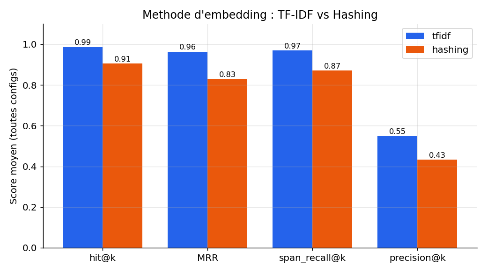
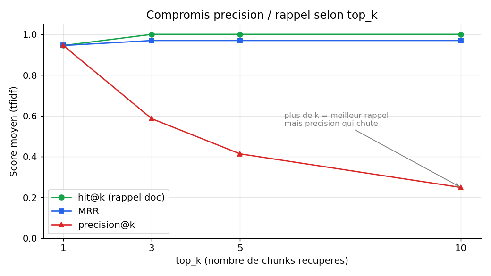
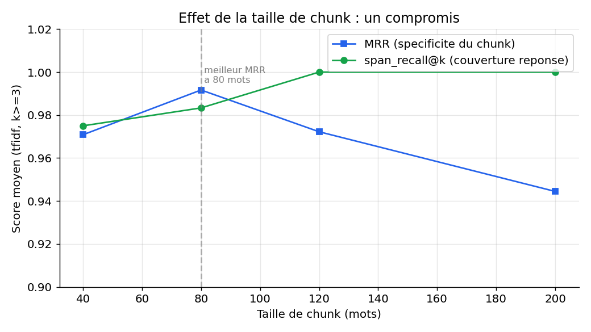

# RAG Eval & Tuning — système RAG avec évaluation et tuning d'hyperparamètres

[](https://github.com/<ton-user>/rag-eval-tuning/actions)


Un système **RAG** (Retrieval-Augmented Generation) complet et, surtout, un **harnais
d'évaluation** qui mesure objectivement l'impact des hyperparamètres (taille de chunk,
overlap, `top_k`, méthode d'embedding) sur la qualité du retrieval.

> Le pipeline RAG est volontairement simple et lisible. **La valeur du projet est
> l'évaluation rigoureuse et le tuning** — passer de « j'ai branché un RAG » à
> « j'ai mesuré quelle configuration marche le mieux, et pourquoi ».

---

## Ce que fait le projet

- Construit un pipeline RAG sur une **base de connaissances métier** (10 documents, FR).
- Évalue **88 configurations** d'hyperparamètres sur un **jeu de 20 questions** à
  vérité-terrain, avec 4 métriques de retrieval (`hit@k`, `MRR`, `span_recall@k`,
  `precision@k`).
- Produit un **tableau de résultats** + des **figures** + un **notebook d'analyse**
  qui désigne la meilleure configuration et l'explique.
- Tourne **100 % hors-ligne** pour l'évaluation (embeddings TF-IDF/hashing, aucun
  téléchargement) — donc **reproductible en CI, sans GPU**.
- Chemin « production » branché : **Ollama** (Mistral/Llama 3 + embeddings) et
  **sentence-transformers** pour une vraie recherche sémantique.

## Architecture

```mermaid
flowchart LR
    A[Corpus .md<br/>base de connaissances] --> B[Chunking<br/>size / overlap]
    B --> C[Embeddings<br/>tfidf · hashing · ST · ollama]
    C --> D[(Index vectoriel<br/>numpy / FAISS)]
    Q[Question] --> C
    D --> E[Retrieval top_k]
    E --> F[LLM<br/>ollama / extractif]
    F --> G[Réponse + sources]
    E -.évalué contre.-> H[[Jeu d'évaluation<br/>20 Q&R vérité-terrain]]
    H --> I{{Métriques<br/>hit@k · MRR · span_recall · precision}}
```

Le harnais d'évaluation (branche du bas) est **indépendant du LLM** : il ne juge que le
retrieval, ce qui rend le tuning d'hyperparamètres mesurable et reproductible.

## Résultats

Balayage de 88 configurations (embeddings hors-ligne). Toutes les figures sont
régénérées par la CI à chaque push.

**Choix de la méthode d'embedding** — TF-IDF domine le hashing sur toutes les métriques :



**Compromis précision / rappel selon `top_k`** — au-delà de k=3, le rappel plafonne mais
la précision s'effondre :



**Effet de la taille de chunk** — sweet spot autour de 80–120 mots (couverture de la
réponse vs spécificité du chunk) :



**Meilleure configuration trouvée :** `embedding=tfidf`, `chunk_size=80`,
`chunk_overlap=40`, `top_k=1` → **hit@k = 1.00, MRR = 1.00, span_recall@k = 1.00,
precision@k = 1.00**.

L'analyse complète (tableaux, heatmap chunk_size × overlap, conclusions) est dans
[`notebooks/analysis.ipynb`](notebooks/analysis.ipynb).

## Démarrage rapide (hors-ligne, aucun modèle)

```bash
pip install -r requirements.txt

# 1. Lancer le balayage d'hyperparamètres -> results/results.csv
python scripts/run_eval.py

# 2. Générer les figures -> results/figures/*.png
python scripts/make_figures.py

# 3. Poser une question (mode extractif, sans LLM)
python scripts/ask.py "Combien de jours de télétravail par semaine ?"

# 4. Tests
PYTHONPATH=src pytest -q
```

(Ou simplement `make eval`, `make figures`, `make test`.)

## Chemin « production » avec un LLM local (Ollama)

Le plan portfolio vise un **LLM open-weight gratuit et 100 % local**. Une fois
[Ollama](https://ollama.com) installé :

```bash
ollama pull mistral            # ou llama3
ollama pull nomic-embed-text   # embeddings sémantiques
pip install requests

python scripts/ask.py "Quel est le préavis de démission pour un cadre ?" \
    --embedding ollama --llm ollama --model mistral
```

Pour comparer un embedding **sémantique** dans le sweep, ajouter `"ollama"` ou
`"sentence-transformers"` à la liste `embedding` dans `config.yaml`.

### Évaluation de la génération (façon RAGAS)

Les métriques de retrieval ne jugent pas le texte généré. Pour évaluer la **fidélité**
et la **pertinence** de la réponse du LLM, `ragkit.metrics.ragas_evaluate(...)` utilise
un LLM juge (Ollama). C'est l'extension naturelle du projet une fois Ollama disponible.

## Structure du dépôt

```
rag-eval-tuning/
├── data/
│   ├── corpus/            # 10 documents .md (base de connaissances métier)
│   └── eval/questions.json# 20 questions à vérité-terrain
├── src/ragkit/            # le package
│   ├── chunking.py        # découpage en chunks (fenêtre glissante)
│   ├── embeddings.py      # 4 backends pluggables
│   ├── vectorstore.py     # index cosinus (numpy) + variante FAISS
│   ├── llm.py             # génération (ollama / extractif)
│   ├── pipeline.py        # assemblage du RAG
│   ├── metrics.py         # ⭐ cœur : métriques de retrieval + normalisation
│   └── evaluate.py        # moteur de balayage
├── scripts/
│   ├── run_eval.py        # lance le sweep -> results.csv
│   ├── make_figures.py    # génère les figures
│   └── ask.py             # interroge le RAG en CLI
├── notebooks/analysis.ipynb  # ⭐ analyse et choix de la config
├── results/               # results.csv + figures/ (générés)
├── tests/                 # tests unitaires (pytest)
├── config.yaml            # grille d'hyperparamètres
└── .github/workflows/ci.yml  # tests + sweep rejoués à chaque push
```

## Choix de conception (et pourquoi)

- **Backends pluggables** (embeddings & LLM) : permet de faire tourner l'évaluation
  hors-ligne en CI *et* de brancher un vrai LLM local, sans changer le code.
- **Métriques de retrieval sans LLM** : le tuning d'hyperparamètres devient
  déterministe et reproductible — condition d'une évaluation crédible.
- **Vérité-terrain explicite** (`source_doc` + `answer_span`) : chaque question sait
  quel document et quel extrait constituent la bonne réponse.
- **Normalisation robuste** (accents, markdown, casse) pour un matching de spans fiable.

## Limites (honnêteté)

Projet d'**apprentissage**, pas un système de production. Le corpus est petit et
synthétique, l'évaluation porte surtout sur le retrieval, et la génération n'est évaluée
qualitativement qu'avec Ollama. L'objectif assumé : **comprendre et mesurer** un RAG en
le construisant.

## Stack

Python · scikit-learn · pandas · matplotlib · (optionnel) Ollama, sentence-transformers,
FAISS · GitHub Actions.

---

*Licence MIT.*
